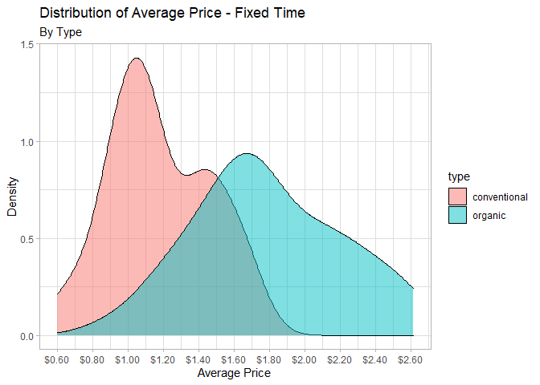
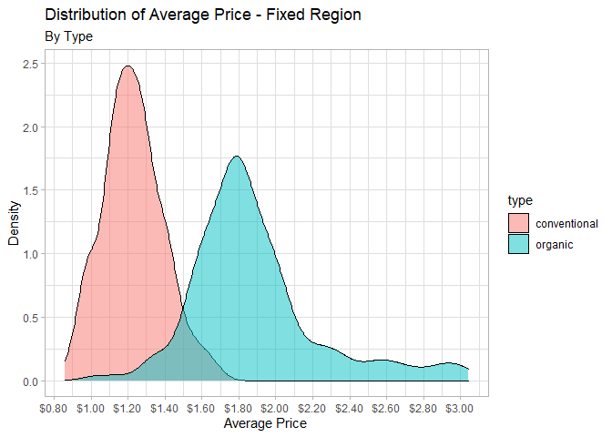
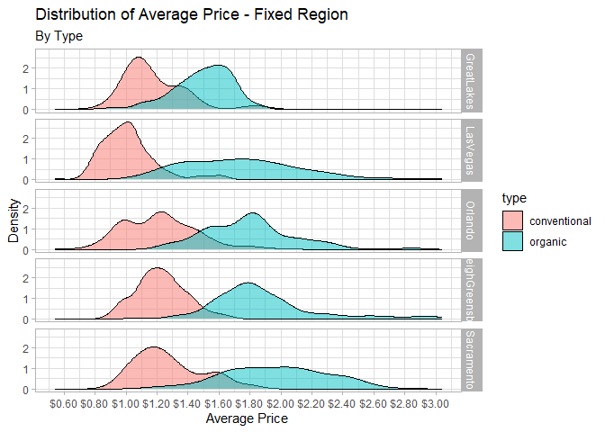
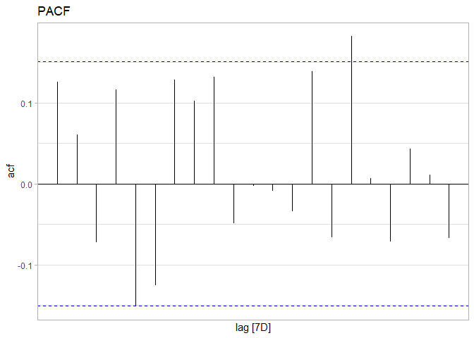
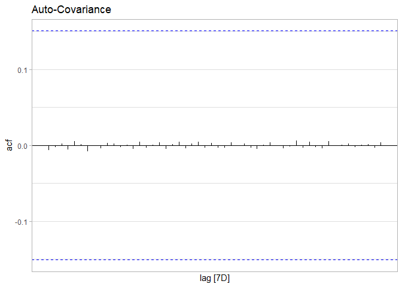
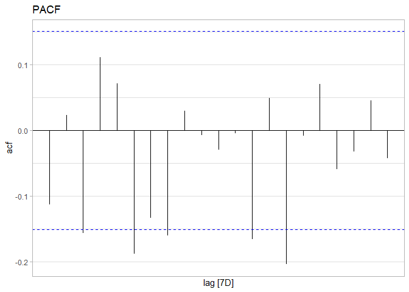
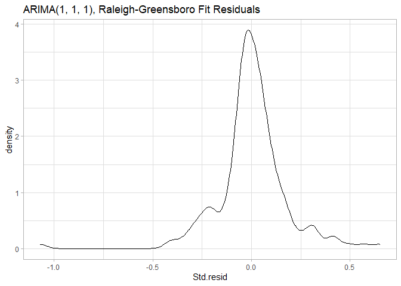

Introduction
============

Holly is a Regional Manager of a coffee shop chain is looking to bring
avocados on the menu. They’re trendy, expensive, and ripe for a short
window of time, therefore she wants to be sure about this purchase.
Lucky for Holly, the coffee shop has partnered with a bakery chain. The
cost of the spices and flare of the avo.toast is negligible. Therefore,
we want to know the cost of the avocados specifically.

Objective
---------

-   Predict the retail cost of avocados for regions of interest
-   Develop a price model to profit off the Avocado

Exploratory Data Analysis
=========================

One should always spend some effort exporing the dataset. To start, here
is a blurb about our Avocados dataset from Kaggle:

> The table below represents weekly 2018 retail scan data for National
> retail volume (units) and price. Retail scan data comes directly from
> retailers’ cash registers based on actual retail sales of Hass
> avocados. Starting in 2013, the table below reflects an expanded,
> multi-outlet retail data set. Multi-outlet reporting includes an
> aggregation of the following channels: grocery, mass, club, drug,
> dollar and military. The Average Price (of avocados) in the table
> reflects a per unit (per avocado) cost, even when multiple units
> (avocados) are sold in bags. The Product Lookup codes (PLU’s) in the
> table are only for Hass avocados. Other varieties of avocados
> (e.g. greenskins) are not included in this table.

More info about the Avocados dataset can be found
[https://www.kaggle.com/neuromusic/avocado-prices](here).

Feeling out the Data
--------------------

It’s good practice to view a summary of the dataset as is.

``` r
avocados %>% summary()
```

    ##        X1             Date             AveragePrice    Total Volume     
    ##  Min.   : 0.00   Min.   :2015-01-04   Min.   :0.440   Min.   :      85  
    ##  1st Qu.:10.00   1st Qu.:2015-10-25   1st Qu.:1.100   1st Qu.:   10839  
    ##  Median :24.00   Median :2016-08-14   Median :1.370   Median :  107377  
    ##  Mean   :24.23   Mean   :2016-08-13   Mean   :1.406   Mean   :  850644  
    ##  3rd Qu.:38.00   3rd Qu.:2017-06-04   3rd Qu.:1.660   3rd Qu.:  432962  
    ##  Max.   :52.00   Max.   :2018-03-25   Max.   :3.250   Max.   :62505647  
    ##       4046               4225               4770           Total Bags      
    ##  Min.   :       0   Min.   :       0   Min.   :      0   Min.   :       0  
    ##  1st Qu.:     854   1st Qu.:    3009   1st Qu.:      0   1st Qu.:    5089  
    ##  Median :    8645   Median :   29061   Median :    185   Median :   39744  
    ##  Mean   :  293008   Mean   :  295155   Mean   :  22840   Mean   :  239639  
    ##  3rd Qu.:  111020   3rd Qu.:  150207   3rd Qu.:   6243   3rd Qu.:  110783  
    ##  Max.   :22743616   Max.   :20470573   Max.   :2546439   Max.   :19373134  
    ##    Small Bags         Large Bags       XLarge Bags           type          
    ##  Min.   :       0   Min.   :      0   Min.   :     0.0   Length:18249      
    ##  1st Qu.:    2849   1st Qu.:    127   1st Qu.:     0.0   Class :character  
    ##  Median :   26363   Median :   2648   Median :     0.0   Mode  :character  
    ##  Mean   :  182195   Mean   :  54338   Mean   :  3106.4                     
    ##  3rd Qu.:   83338   3rd Qu.:  22029   3rd Qu.:   132.5                     
    ##  Max.   :13384587   Max.   :5719097   Max.   :551693.7                     
    ##       year         region         
    ##  Min.   :2015   Length:18249      
    ##  1st Qu.:2015   Class :character  
    ##  Median :2016   Mode  :character  
    ##  Mean   :2016                     
    ##  3rd Qu.:2017                     
    ##  Max.   :2018

``` r
unique(avocados$type)
```

    ## [1] "conventional" "organic"

``` r
unique(avocados$region)
```

    ##  [1] "Albany"              "Atlanta"             "BaltimoreWashington"
    ##  [4] "Boise"               "Boston"              "BuffaloRochester"   
    ##  [7] "California"          "Charlotte"           "Chicago"            
    ## [10] "CincinnatiDayton"    "Columbus"            "DallasFtWorth"      
    ## [13] "Denver"              "Detroit"             "GrandRapids"        
    ## [16] "GreatLakes"          "HarrisburgScranton"  "HartfordSpringfield"
    ## [19] "Houston"             "Indianapolis"        "Jacksonville"       
    ## [22] "LasVegas"            "LosAngeles"          "Louisville"         
    ## [25] "MiamiFtLauderdale"   "Midsouth"            "Nashville"          
    ## [28] "NewOrleansMobile"    "NewYork"             "Northeast"          
    ## [31] "NorthernNewEngland"  "Orlando"             "Philadelphia"       
    ## [34] "PhoenixTucson"       "Pittsburgh"          "Plains"             
    ## [37] "Portland"            "RaleighGreensboro"   "RichmondNorfolk"    
    ## [40] "Roanoke"             "Sacramento"          "SanDiego"           
    ## [43] "SanFrancisco"        "Seattle"             "SouthCarolina"      
    ## [46] "SouthCentral"        "Southeast"           "Spokane"            
    ## [49] "StLouis"             "Syracuse"            "Tampa"              
    ## [52] "TotalUS"             "West"                "WestTexNewMexico"

From the summary, we notice a couple of things.

-   X1 are weeks of the year, enumerated in reverse.
-   Date was read in properly.
-   The average price of an avocado never is between 44 cents and $3.25.
-   At one point, 63 million avocados were sold from one region in a
    single week!
-   Type and Region should be formatted to factors.
-   Regions are Cities, States, and US Regions. Let’s remove US Regions,
    as it double counts some cities and states.

``` r
avocados %>%
  filter(!region %in% c('Midsouth', 'Northeast', 'SouthCentral', 'Southeast', 'TotalUS', 'West')) %>%
  rename(Week_no = X1) %>%
  mutate(type    = as.factor(type),
         region  = as.factor(region),
         Week_no = as.factor(abs(Week_no-52))) -> avocados

summary(avocados$region)
```

    ##              Albany             Atlanta BaltimoreWashington               Boise 
    ##                 338                 338                 338                 338 
    ##              Boston    BuffaloRochester          California           Charlotte 
    ##                 338                 338                 338                 338 
    ##             Chicago    CincinnatiDayton            Columbus       DallasFtWorth 
    ##                 338                 338                 338                 338 
    ##              Denver             Detroit         GrandRapids          GreatLakes 
    ##                 338                 338                 338                 338 
    ##  HarrisburgScranton HartfordSpringfield             Houston        Indianapolis 
    ##                 338                 338                 338                 338 
    ##        Jacksonville            LasVegas          LosAngeles          Louisville 
    ##                 338                 338                 338                 338 
    ##   MiamiFtLauderdale           Nashville    NewOrleansMobile             NewYork 
    ##                 338                 338                 338                 338 
    ##  NorthernNewEngland             Orlando        Philadelphia       PhoenixTucson 
    ##                 338                 338                 338                 338 
    ##          Pittsburgh              Plains            Portland   RaleighGreensboro 
    ##                 338                 338                 338                 338 
    ##     RichmondNorfolk             Roanoke          Sacramento            SanDiego 
    ##                 338                 338                 338                 338 
    ##        SanFrancisco             Seattle       SouthCarolina             Spokane 
    ##                 338                 338                 338                 338 
    ##             StLouis            Syracuse               Tampa    WestTexNewMexico 
    ##                 338                 338                 338                 335

``` r
summary(avocados$type)
```

    ## conventional      organic 
    ##         8112         8109

This data is timeseries data. What does a slice of time look like? Do we
have a consistent slice of time for each Date recorded?

``` r
avocados %>%
  group_by(Date, type) %>%
  summarize(Region_Ct = length(unique(region))) %>% summary()
```

    ##       Date                      type       Region_Ct    
    ##  Min.   :2015-01-04   conventional:169   Min.   :47.00  
    ##  1st Qu.:2015-10-25   organic     :169   1st Qu.:48.00  
    ##  Median :2016-08-14                      Median :48.00  
    ##  Mean   :2016-08-14                      Mean   :47.99  
    ##  3rd Qu.:2017-06-04                      3rd Qu.:48.00  
    ##  Max.   :2018-03-25                      Max.   :48.00

The Region\_Ct confirms the missing data.

Looks like we are missing some data from WestTexNewMexico region, in
particular 3 index values of their organic ’cados. Looking at this
missing data more closely:

``` r
avocados %>% 
  filter(type == 'organic' & region == 'WestTexNewMexico') %>%
  pull(Date) %>%
  sort() -> test_issue
(test_issue2 <- difference(test_issue))
```

    ## Time differences in days
    ##   [1] NA  7  7  7  7  7  7  7  7  7  7  7  7  7  7  7  7  7  7  7  7  7  7  7  7
    ##  [26]  7  7  7  7  7  7  7  7  7  7  7  7  7  7  7  7  7  7  7  7  7  7  7 14  7
    ##  [51]  7  7  7  7  7  7  7  7  7  7  7  7  7  7  7  7  7  7  7  7  7  7  7  7  7
    ##  [76]  7  7  7  7  7  7  7  7  7  7  7  7  7  7  7  7  7  7  7  7  7  7  7  7  7
    ## [101]  7  7  7  7  7  7  7  7  7  7  7  7  7  7  7  7  7  7  7  7  7  7  7  7  7
    ## [126]  7  7 21  7  7  7  7  7  7  7  7  7  7  7  7  7  7  7  7  7  7  7  7  7  7
    ## [151]  7  7  7  7  7  7  7  7  7  7  7  7  7  7  7  7

``` r
test_issue[which(test_issue2 > 7)]
```

    ## [1] "2015-12-13" "2017-07-02"

``` r
avocados %>% 
  filter(type == 'organic' & region == 'WestTexNewMexico') %>%
  arrange(Date) %>%
  slice(c(which(test_issue2 > 7)-1,which(test_issue2 > 7),which(test_issue2 > 7)+1)) %>%
  arrange(Date)
```

    ## # A tibble: 6 x 14
    ##   Week_no Date       AveragePrice `Total Volume` `4046` `4225` `4770`
    ##   <fct>   <date>            <dbl>          <dbl>  <dbl>  <dbl>  <dbl>
    ## 1 49      2015-11-29         2.08          4638.  1395.  2238.   61.7
    ## 2 50      2015-12-13         1.8           7837.  2194.  2981.   26.0
    ## 3 51      2015-12-20         1.92          6255.  1512.  2407.   11.8
    ## 4 25      2017-06-11         1.66         21170.  3042.  3588.    0  
    ## 5 26      2017-07-02         1.59         20486.  2455.  3471.    0  
    ## 6 27      2017-07-09         1.65         18244.  2296.  3701.   38.7
    ## # ... with 7 more variables: `Total Bags` <dbl>, `Small Bags` <dbl>, `Large
    ## #   Bags` <dbl>, `XLarge Bags` <dbl>, type <fct>, year <dbl>, region <fct>

The missing data is not a big deal. We are missint a week of data in
December 2015 and two weeks of data in June 2017 for West Texas + New
Mexcico. We can handle it by filling in the mean of the surrounding
values. We will not do that here, as it’s not that relevant to my
analysis.

Visualizing data
----------------

Let’s start by visulizing Average Price

``` r
avocados %>%
  ggplot() +
  geom_density(aes(x = AveragePrice), fill = 'grey', alpha = 0.5) +
  labs(title = 'Distribution of Average Price',
       x = 'Average Price',
       y = 'Density') +
  scale_x_continuous(labels = scales::dollar_format(), 
                     breaks = scales::pretty_breaks(n = 12))
```

 We see
a right skewed bell shaped distribution that might be bimodal. Maybe it
is best to look at one slice of time.

``` r
avocados %>%
  filter(Week_no == 18 & year == 2017) %>% # time chosen arbitrarily
  ggplot() +
  geom_density(aes(x = AveragePrice), fill = 'grey', alpha = 0.5) +
  labs(title = 'Distribution of Average Price',
       x = 'Average Price',
       y = 'Density') +
  scale_x_continuous(labels = scales::dollar_format(), 
                     breaks = scales::pretty_breaks(n = 12))
```

 Our two
humps are still there. This might be due to the type of Avocado. Organic
vs. Conventional.

``` r
avocados %>%
  filter(Week_no == 18 & year == 2017) %>%
  ggplot() +
  geom_density(aes(x = AveragePrice, fill = type), alpha = 0.5) +
  labs(title = 'Distribution of Average Price - Fixed Time',
       subtitle = 'By Type',
       x = 'Average Price',
       y = 'Density') +
  scale_x_continuous(labels = scales::dollar_format(), 
                     breaks = scales::pretty_breaks(n = 12))
```

 Well,
kind of… The Conventional Avocados look to have a bimodal distribution,
while the organic ’cados are centered around a $1.70. Though, the
organic ’cados have a fat tail, and it seems that a small hump is
emerging from it.

So our Average price is not exactly what you would say “Normally
Distributed” across regions for a given slice of time. What does the
price look like across time for a fixed region?

``` r
avocados %>%
  filter(region == 'RaleighGreensboro') %>%
  ggplot() +
  geom_density(aes(x = AveragePrice, fill = type), alpha = 0.5) +
  labs(title = 'Distribution of Average Price - Fixed Region',
       subtitle = 'By Type',
       x = 'Average Price',
       y = 'Density') +
  scale_x_continuous(labels = scales::dollar_format(), 
                     breaks = scales::pretty_breaks(n = 12))
```


As we narrow our focus we see the resolution of our dataset sharpen.
Organic and conventional avocados have a nice bell shape to them. Is
this the case for all regions?

``` r
set.seed(123)
avocados %>%
  filter(region %in% sample(avocados$region, 5)) %>%
  ggplot() +
  geom_density(aes(x = AveragePrice, fill = type), alpha = 0.5) +
  labs(title = 'Distribution of Average Price - Fixed Region',
       subtitle = 'By Type',
       x = 'Average Price',
       y = 'Density') +
  scale_x_continuous(labels = scales::dollar_format(), 
                     breaks = scales::pretty_breaks(n = 12)) +
  facet_grid(region ~ .)
```



Oh no, having a nice bell shaped distribution is certaintly not
ubiquitous across all regions. The thing is, we are considering data the
takes place over time. The fact that we don’t have bell shapped
distributions means that our Average Price is likely sensitive to when
it was aggregated. And the timing of when it was aggregated leads us to
consider methods of time series analysis.

We start by considering the the average avocado price from 2015 - 2018.

``` r
avocados %>%
  group_by(Date, type) %>%
  summarise(MeanPrice = mean(AveragePrice)) %>%
  ggplot() +
  geom_line(aes(x = Date, y = MeanPrice, color = type), size = 1) +
  scale_y_continuous(labels = scales::dollar_format(), breaks = scales::pretty_breaks(n = 7)) +
  scale_x_date(breaks = scales::pretty_breaks(n = 14)) +
  labs(title = "Ecological Average Avocado Price Over Time",
       subtitle = "United States, 2015 - 2018",
       x = "", y = "Average Price",
       caption = 'Source: Kaggle neuromusic/avocado-prices') +
  theme(axis.text.x = element_text(angle = 290, hjust = 0, vjust = 0))
```



There are not any obvious trends to be observed from the time series.
The volitility in avocado prices seems to have peaked in October 2017.

I suspect it will be more useful to investigate particular regions. We
can’t look at all regions simultaneously, so we’ll considered three
segments.

1.  Regions with the most expensive avocado during a certain time
2.  Regions with the least expensive avocado during a certain time
3.  Randomly selected regions

Most Expensive:

``` r
avocados %>%
  filter(year == 2017) %>%
  group_by(region) %>%
  summarise(MeanPrice = mean(AveragePrice)) %>%
  ungroup() %>%
  top_n(2, MeanPrice) %>% 
  pull(region) -> exp_places

avocados %>%
  filter(region %in% exp_places) %>%
  ggplot() +
  geom_line(aes(x = Date, y = AveragePrice, color = region, linetype = type), size = 1, alpha = .7) +
  scale_y_continuous(labels = scales::dollar_format(), breaks = scales::pretty_breaks(n = 7)) +
  scale_x_date(breaks = scales::pretty_breaks(n = 25)) +
  labs(title = "Most Expensive Avocados",
       x = "", y = "Average Price") +
  theme(axis.text.x = element_text(angle = 290, hjust = 0, vjust = 0)) -> gg1
  
avocados %>%
  filter(year == 2017) %>%
  group_by(region) %>%
  summarise(MeanPrice = mean(AveragePrice)) %>%
  ungroup() %>%
  top_n(-2, MeanPrice) %>% 
  pull(region) -> chp_places

avocados %>%
  filter(region %in% chp_places) %>%
  ggplot() +
  geom_line(aes(x = Date, y = AveragePrice, color = region, linetype = type), size = 1, alpha = .7) +
  scale_y_continuous(labels = scales::dollar_format(), breaks = scales::pretty_breaks(n = 7)) +
  scale_x_date(breaks = scales::pretty_breaks(n = 25)) +
  labs(title = "Least Expensive Avocados",
       x = "", y = "Average Price") +
  theme(axis.text.x = element_text(angle = 290, hjust = 0, vjust = 0)) -> gg2

avocados %>% 
  filter(!region %in% c(exp_places, chp_places)) %>% 
  pull(region) %>%
  unique() %>%
  sample(2) -> rnd_places

avocados %>%
  filter(region %in% rnd_places) %>%
  ggplot() +
  geom_line(aes(x = Date, y = AveragePrice, color = region, linetype = type), size = 1, alpha = .7) +
  scale_y_continuous(labels = scales::dollar_format(), breaks = scales::pretty_breaks(n = 7)) +
  scale_x_date(breaks = scales::pretty_breaks(n = 25)) +
  labs(title = "Randomly Selected Regions",
       x = "", y = "Average Price") +
  theme(axis.text.x = element_text(angle = 290, hjust = 0, vjust = 0))-> gg3

gg1 / gg2 / gg3
```



As I comb through this data, it would be nice to have a line mark where
I am in each line graph. Would require some fancy javascript.

Overall, we see that the trends are broadly similarly. Prices swell in
2017… but really only for the most expensive regions. The least
expensive regions and randomly selected regions swell in 2017 a couple
lags after the most expensive regions. This may hint at the most
expensive regions being a factor for other US regions.

Strike a pose
-------------

When modeling data it is helpful to have a specific question or
objective in mind. Here I want to consider the following: A regional
manager of a cafe chain is considering adding avocado toast to the menu.
They want to know how much they should pay for the ’cados. Suppose the
regional manager is concerned about East Coast stores. Can we build a
model that predicts the price of avocados for each region. This model
will inform a price model for avocados.

Objectives:

-   Build a model that predicts the price of avocados for each region of
    concern
-   Forecast the price of avocados for Q3 2018.
-   Summarize the forecast

### Time Series Approach

For time series modeling, we’ll do some light formatting.

``` r
avocados %>%
  select(Date, AveragePrice, `Total Volume`, type, region) %>%
  as_tsibble(key = c(type, region), index = Date) %>%
  arrange(Date) -> avocados_ts

unique(avocados_ts$region)
```

    ##  [1] Albany              Atlanta             BaltimoreWashington
    ##  [4] Boise               Boston              BuffaloRochester   
    ##  [7] California          Charlotte           Chicago            
    ## [10] CincinnatiDayton    Columbus            DallasFtWorth      
    ## [13] Denver              Detroit             GrandRapids        
    ## [16] GreatLakes          HarrisburgScranton  HartfordSpringfield
    ## [19] Houston             Indianapolis        Jacksonville       
    ## [22] LasVegas            LosAngeles          Louisville         
    ## [25] MiamiFtLauderdale   Nashville           NewOrleansMobile   
    ## [28] NewYork             NorthernNewEngland  Orlando            
    ## [31] Philadelphia        PhoenixTucson       Pittsburgh         
    ## [34] Plains              Portland            RaleighGreensboro  
    ## [37] RichmondNorfolk     Roanoke             Sacramento         
    ## [40] SanDiego            SanFrancisco        Seattle            
    ## [43] SouthCarolina       Spokane             StLouis            
    ## [46] Syracuse            Tampa               WestTexNewMexico   
    ## 48 Levels: Albany Atlanta BaltimoreWashington Boise Boston ... WestTexNewMexico

#### Exploring the time series

``` r
avocados_ts %>% 
  filter(type == 'organic' & region == 'RaleighGreensboro') %>%
  ACF(AveragePrice) %>%
  autoplot() +
  labs(title = 'ACF')
```


``` r
avocados_ts %>% 
  filter(type == 'organic' & region == 'RaleighGreensboro') %>% 
  ACF(AveragePrice, type = 'covariance') %>%
  autoplot() +
  labs(title = 'Auto-Covariance')
```


``` r
avocados_ts %>% 
  filter(type == 'organic' & region == 'RaleighGreensboro') %>% 
  ACF(AveragePrice, type = 'partial') %>%
  autoplot() +
  labs(title = 'PACF')
```

 The
ACF plot above shows significant tailing, suggesting that we perform a
difference on the data.

``` r
avocados_ts %>% 
  filter(type == 'organic' & region == 'RaleighGreensboro') %>%
  ACF(difference(AveragePrice)) %>%
  autoplot() +
  labs(title = 'ACF')
```


``` r
avocados_ts %>% 
  filter(type == 'organic' & region == 'RaleighGreensboro') %>%
  ACF(difference(AveragePrice), type = 'covariance', lag_max = 52) %>%
  autoplot() +
  labs(title = 'Auto-Covariance')
```



``` r
avocados_ts %>% 
  filter(type == 'organic' & region == 'RaleighGreensboro') %>% 
  ACF(difference(AveragePrice), type = 'partial') %>%
  autoplot() +
  labs(title = 'PACF')
```

 The
data doesn’t seem to correlate with itself, and the covariance is close
to zero.

``` r
avocados_ts %>% 
  filter(type == 'organic' & region == 'RaleighGreensboro') %>% 
  autoplot(difference(AveragePrice))
```

    ## Warning: Removed 1 row(s) containing missing values (geom_path).


``` r
avocados_ts %>% 
  filter(type == 'organic' & region == 'RaleighGreensboro') %>% 
  autoplot(difference(`Total Volume`))
```

    ## Warning: Removed 1 row(s) containing missing values (geom_path).

 We see
that the differenced data looks like white noise with increasing
variance. Of course, we are only looking at one region. Ideally we’d
like to investigate all regions.

#### Determining covariance of all regions x type

``` r
regns <- unique(avocados_ts$region)
typez <- unique(avocados_ts$type)

region_of_int <- c()
type_of_int <- c()
check_out <- c()

for (i in typez) {
  for (j in regns) {
    if(i == 'organic' & j == 'WestTexNewMexico') {next()}
    avocados_ts %>%
      filter(type == i & region == j) %>%
      #filter(type == 'organic' & region == 'RaleighGreensboro')  %>%
      arrange(Date) %>%
      ACF(difference(AveragePrice), type = 'covariance') -> avo_acfs
    acfs <- abs(avo_acfs$acf) > 0.15
    if (sum(acfs) > 0) {
      region_of_int <- append(region_of_int, j)
      type_of_int   <- append(region_of_int, i)
    } 
  }
}
length(region_of_int)
```

    ## [1] 0

``` r
length(type_of_int)
```

    ## [1] 0

With such a low covariance, perhaps a linear model that assumes
indepence between events is worth trying. Below we try

``` r
# Dummy data.frame. Classes will be coerced upon appending data
cado_ts1 <- data.frame(type = c(), region = c(), `ARIMA(AveragePrice)`= c())
trigger <- 0

for (i in typez) {
  for (j in regns) {
    if(i == 'organic' & j == 'WestTexNewMexico') {next()}
    avocados_ts %>%
      filter(region == j & type == i) %>%
      # This auto fits an ARIMA model, choosing the best fit based on minimizing AIC, AICc OR BIC.
      model(ARIMA(AveragePrice, ic = 'aic')) -> ts1
    mdl.class <- class(ts1)
    cado_ts1 <- bind_rows(cado_ts1, ts1)
    if (trigger == 0) {collected_attr <- attributes(ts1); trigger <- 1}
  }
}

#head(cado_ts1)
```

We now have an initial iteration of our model above. I started with a
time series approach given the nature of the data, however we will also
explore some linear approaches as well.

Choosing AIC as the criteria to select our model is not my ideal
approach. AIC does not punish model complexity.

Additionally, a warning was thrown (I did not show in the output as it
repeats 96 types). *Vectorizing ‘lst\_mdl’ elements may not preserve
their attributes.* I did some research about attributes and R objects to
get a sense for how to deal with this. The solution I’ve come up with is
probably not the best way, but allows me to keep the models organized in
the data.frame still.

To deal with the missing attributes, here is my adhoc solution. It’s
mostly guard rail coding that makes it easy to comeback to and use.

``` r
mdl_select <- function(model, case = NULL, xtype = NULL, xregion = NULL) {
  
  # Checks to see if any choice was made
  if(is.null(case) & (is.null(xtype) | is.null(xregion))) 
    {
    return('Error: Select filter criteria. Chose a numeric case or type and region strings')
    
    # Checks to see if too many choices were made
  } else if (!is.null(case) & (!is.null(xtype) | !is.null(xregion))) {
    return('Error: Select filter criteria. Limit choices to either case or type and region.')
    }
  
  # Checks which criteria to filter by
  if(!is.null(case)) {
    
    # Checks that case is the right mode
    if(!is.numeric(case)) {return('Error: Case should be numeric integer.')}
    
    # Meat and potatoes of the function right here:
    model <- slice(model, case)
    attributes(model) <- collected_attr
    return(model)
    
  } else {
    
    # Checks that the type and regions exist in data frame
    if(!xtype %in% unique(model$type) | !xregion %in% unique(model$region)) {return('Error: type or region not in model.')}
    
    # Main part of the function here
    model <- filter(model, type == xtype & region == xregion)
    attributes(model) <- collected_attr
    return(model)
  }
}
```

Now that we have a quick and dirty way to fix the missing attributes.
We’ll test it out below.

Visualizing residuals, then performing diagnostics.

``` r
gg_tsresiduals(mdl_select(cado_ts1, xtype = 'organic', xregion = 'RaleighGreensboro'))
```


Alright, we’re in business. I don’t think the fit looks too bad
Raleigh-Greensboro organic avocados. Residuals look close to normally
distributed.

``` r
report(mdl_select(cado_ts1, xtype = 'organic', xregion = 'RaleighGreensboro'))
```

    ## Series: AveragePrice 
    ## Model: ARIMA(1,1,1) 
    ## 
    ## Coefficients:
    ##          ar1      ma1
    ##       0.7902  -0.9565
    ## s.e.  0.0777   0.0424
    ## 
    ## sigma^2 estimated as 0.03367:  log likelihood=47.16
    ## AIC=-88.32   AICc=-88.17   BIC=-78.95

``` r
ggplot() +
  geom_density(aes(x = residuals(mdl_select(cado_ts1, xtype = 'organic', xregion = 'RaleighGreensboro'))$.resid)) +
  labs(title = 'ARIMA(1, 1, 1), Raleigh-Greensboro Fit Residuals', x = 'Std.resid')
```

 We see
the selection criteria chose an ARIMA(1, 1, 1) model. The estimates for
p and q are close to one… suggesting a decent fit. I also blew up the
distribution of our residuals. We can see that it’s not exactly normal…

Now we want a scaled way to asses the fit of each ARIMA model. We will
leverage the distribution of our residuals to indicate the fit of our
models. In a time series approach we aim to capture the structure of the
process that generates the data. Should we do a sufficient job of this,
then any fluctations are due to random error. We assume that our random
error is normally distributed. Based on this assumption and our
methodology thus far we will perform test of normality.

I employ the use a skewness calculation and kurosis risk calculation.

``` r
resid_diagnostics <- data.frame(type = c(), region = c(),
                                kurtosis = numeric(0), skew = c())

for (i in typez) {
  for (j in regns) {
    if(i == 'organic' & j == 'WestTexNewMexico') {next()}
    residz <- residuals(mdl_select(cado_ts1, xtype = i, xregion = j))$.resid
    kurts <- kurtosis(residz)
    skuu  <- skewness(residz)
    
    resid_diagnostics <- bind_rows(resid_diagnostics,
                                   data.frame(type = i, region = j,
                                              kurtosis = kurts, skew = skuu))
  }
}
```

``` r
ggplot(resid_diagnostics) +
  geom_density(aes(x = skew, fill = type), alpha = 0.5) +
  geom_rug(aes(x = kurtosis, color = type)) +
  labs(title = 'Skew and Kurtosis Spread', x = 'Density = Skew, Rug = Kurtosis') -> resid_gg

ggplot(resid_diagnostics) +
  geom_boxplot(aes(x = type, y = kurtosis), alpha = 0.5) +
  labs(title = 'Kurtosis Boxplot', x = 'Avocado Type') -> kurt_gg

resid_gg | kurt_gg
```


``` r
resid_diagnostics %>%
  arrange(desc(kurtosis)) %>%
  head(n = 15)
```

    ##     kurtosis         type            region       skew
    ## 1  18.851691      organic  BuffaloRochester -2.1803914
    ## 2  16.919744      organic          Syracuse -2.2053426
    ## 3   7.494796      organic RaleighGreensboro -0.6560070
    ## 4   7.310101      organic             Tampa  1.5435824
    ## 5   6.145554      organic         Charlotte -0.4448824
    ## 6   5.536626      organic MiamiFtLauderdale  0.9856736
    ## 7   5.452853      organic        LosAngeles  1.0782972
    ## 8   5.302185      organic           Houston  0.9537071
    ## 9   4.948095 conventional           Chicago -0.9431709
    ## 10  4.814854      organic            Boston -1.1591310
    ## 11  4.435270      organic        Pittsburgh -1.0931702
    ## 12  4.032180      organic  CincinnatiDayton  0.8160756
    ## 13  3.982946 conventional  CincinnatiDayton -0.6575418
    ## 14  3.958821 conventional   RichmondNorfolk -1.2268011
    ## 15  3.684618      organic       GrandRapids -1.0372287

From this we observe that the error for models of organic avocados does
not seem to be normally distributed. As suspected earlier we might try a
linear model that uses the factors of type and region as well as number
of avocados sold weekly to predict the prices. While we can’t say that
yesterdays prices don’t influences today’s prices of avocados, we can
reach for a solution that models the data with more accurate predictive
power. Perhaps even an ensemble approach would be beneficial here.

### Linear Modeling
