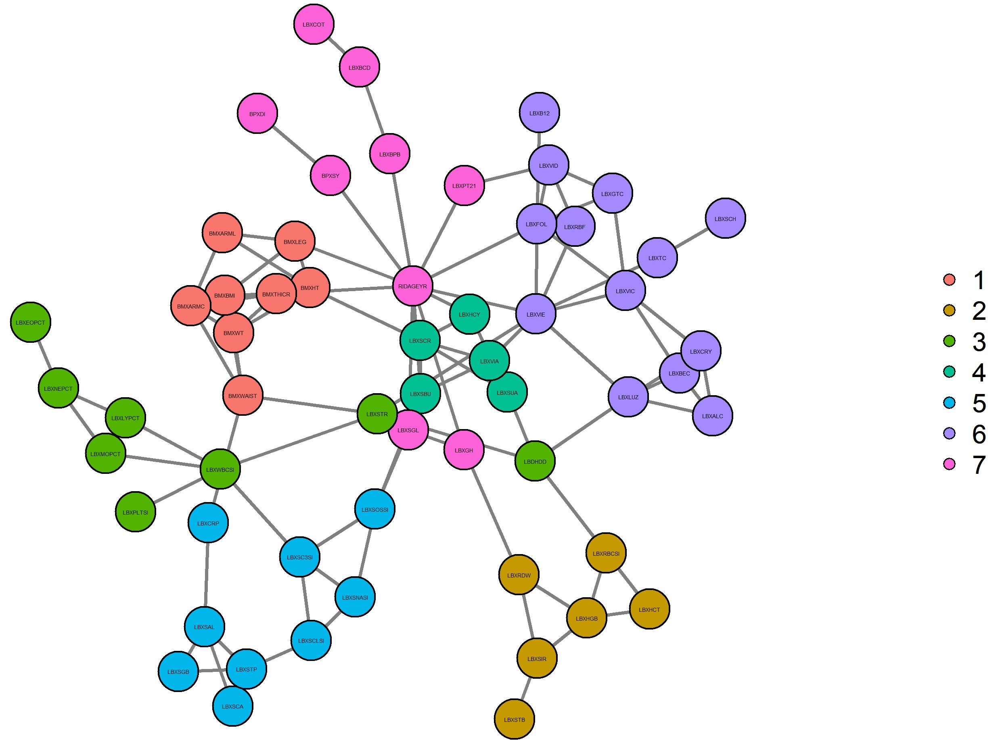

```{r setup, include = F}
library(tidyverse)
library(igraph)
library(imager)
```


## Graphical Models

We can use graphical models to model relationships between a high number of variables if we prune the model to only display relationships between variables that exhibit some partial dependencies. 

For example, let's consider the NHANES dataset in R. 

  - The **N**ational **H**ealth **a**nd **N**utrition **E**xamination **S**urveys is a program of studies about the health and nutrition of people in the US.
  - The data set used here is from 2005-2006 and contains 161 out of the 7,000 variables.
  
```{r loading_NHANES}
# I load the NHANES data from the `muvis` package:
library(muvis)
data('NHANES')

# Preprocessing to impute continuous and categorical variables.
nhanes <- data_preproc(NHANES, levels = 15, detect.outliers = TRUE, alpha = 0.5)
```

Viewing this data in a tabular format would not reveal which variables exhibit partial dependencies. We can succintly convey partial dependences in a graphical model.




### Probabilistic Graphical Models (PGMs)

The above image is the result of pruning a complete graph to one a subset that expresses the similarity in probability distribution between variables. Theoretical frames and methods for developing graphical models include:
  
  - Markov Networks (Markov Random Fields): Helpful in developing Gaussian Graphical Models. This framework allows one to represent a graph $G = (V,E)$. Where $V$ is the set of vertices or nodes, and each node represents a variable in the dataset. $E$ is the set of edges where the edge exist *iff* the partial correlation between the variables (nodes) are not zero.
  - Bayesian Networks (Causal Netowrks): A helpful framework for developing directed graphs that express causality between variables. There doesn't exist an algorithm to investigate the full scope of causality between variables, however I will investigate the Fast Causal Inference Algorithm and its implementation in R.
  - Minimal Forest for High-dimensional Modeling: When the number of variables is too large (hundreds - thousands of variables), it may be inefficient or computationally infeasible to investigate the full set of relationships. I will invesitage the Chow-Liu Algorithm which aims to solve this.
